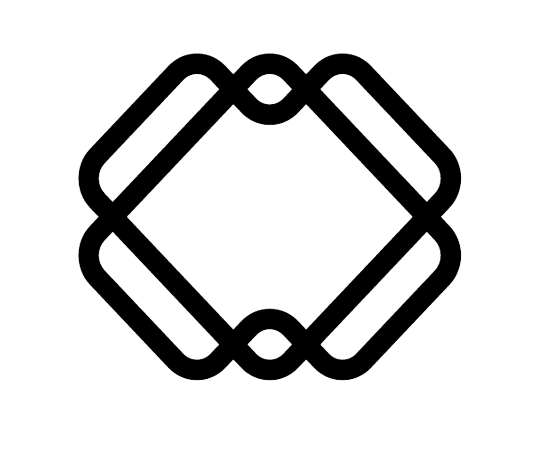



<a href="https://postgresql.org">  

    
# Pegasus: Simulation of In-Orbit Assembly Robot Lab Demonstrator
This repository consists of CAD files and code that were used for creating a simulation of an In-Orbit Assembly Robot. The aim of the project was to successfully create simulation of a robot equipped with three xArm 5  arms attached to its torso. The robot should be able to lift a Space Reticular Structure with one of its arms, walk to a goal and dock the structure to another structure.

# System Requirements
* Operating System: Ubuntu 20.04


# Setup
## Install ROS Noetic and required packages
* [Install ](http://wiki.ros.org/noetic/Installation) ROS Noetic. This simulation has been tested on ROS1 Noetic version. Recommended installation package: 
`$ sudo apt-get install ros-noetic-desktop-full`
* [Install](https://moveit.ros.org/) MoveIt1. MoveIt is a ROS motion planning platform. The trajectory planning for pick and place is controlled using MoveIt.
* Install ROS Gazebo integration packages with the command: 
``
$ sudo apt-get install ros-noetic-gazebo-ros-pkgs ros-noetic-gazebo-ros-control
``
* [Install](https://catkin-tools.readthedocs.io/en/latest/installing.html) `catkin_tools`

## Setup Simulation Code
* Create workspace: `$ mkdir -p ~/catkin_ws/src && cd ~/catkin_ws/src`
* Clone repository: `$ git clone https://github.com/Space-Robotics-Lab-Cranfield-University/GDP-RBT-2023-Group-5.git`
* Build Workspace: `$ catkin build`

## Directory Structure
```
src/
	├── fullbot
	├── fullbot_attacher_plugin
	├── fullbot_magnetic_plugin
	├── fullbot_moveit
	├── geometric_shapes
	├── initial_config
	├── mara
	├── mario_assembly
	├── mario_config
	├── mario_dual
	├── mario_mov
	├── move_robot_base
	├── moveit
	├── moveit_msgs
	├── moveit_resources
	├── moveit_tutorials
	├── moveit_visual_tools
	├── panda_moveit_config
	├── rviz_visual_tools
	├── scripts
	└── srdfdom
```
* fullbot: Contains the URDF and mesh files for describing the robot.
* fullbot_attacher_plugin: Plugin code to attaching and detaching links using joints.
* fullbot_magnetic_plugin: Plugin code for simulating force of attraction between two objects. 
* fullbot_moveit: Configuration files generated by MoveIt. `fullbot_moveit/meshes` directory contain mesh files for SRS and table models. 
* moveit*: Directories generated by MoveIt.

# Running Simulation
* Launch Simulation: 
	```
	$ source devel/setup.bash
	$ roslaunch fullbot_moveit demo_gazebo.lauch
	```
* Spawn Objects:
	```
	$ cd scripts/
	$ python3 adding_srs_model.py
	```
* Trajectory Planning:
		`$ python3 traj_planning.py`

	

